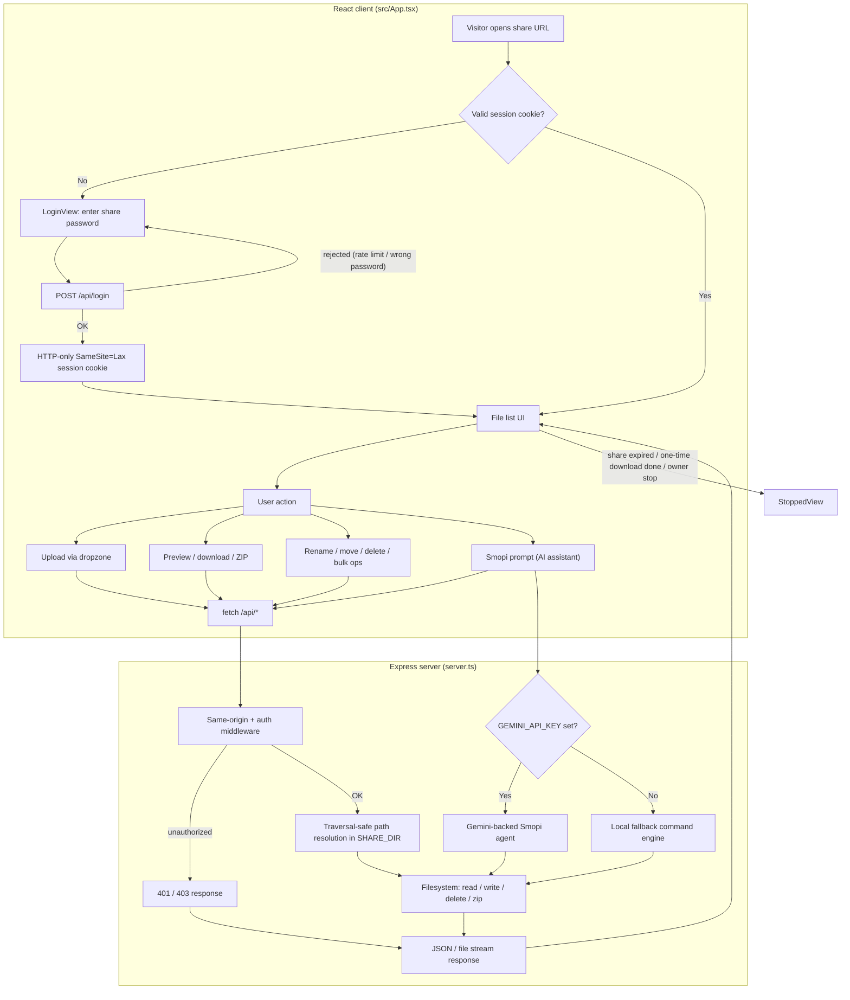

# File Share

A lightweight, password-protected, temporary file-sharing server with an AI
file-management assistant ("Smopi").

This repository contains two implementations:

| Directory | Stack | Status |
|---|---|---|
| **root (`server.ts`, `src/`)** | Node / Express 4 + React 19 + Vite 8 + Tailwind 4 | **Active product** — this is what `npm run dev` / `npm run build` / `npm start` runs |
| **`cloned/`** | Python 3 standard library (+ optional Cloudflare Quick Tunnel) | **Reference upstream** (v3.5.1), superseded by the Node app; not wired into the build |

> ⚠️ `cloned/` exists as the original implementation this project was ported from.
> Its `server.py` and `templates/` are read-only reference material and are not
> executed by any npm script.

## Flow

High-level request flow through the app, from first visit to a file operation:



## Install (one-liner)

The recommended way to run the share on a Linux VPS. Installs Node.js 22 if
needed, clones the repo, builds `dist/server.cjs`, installs the `sdf` command,
sets up a systemd service (when run as root) and runs a diagnostic.

```bash
curl -fsSL https://raw.githubusercontent.com/JCVERSA/smopi/arena/01a0bf28-smopi/scripts/install.sh | sh
```

Interactive (recommended — offers the `.env` wizard at the end):

```bash
sh -c "$(curl -fsSL https://raw.githubusercontent.com/JCVERSA/smopi/arena/01a0bf28-smopi/scripts/install.sh)"
```

Then configure a password and start:

```bash
sdf env            # interactive wizard (password, port, expiry, owner secret)
sdf start          # production server, autostarts on boot under systemd
sdf status         # share stats
sdf doctor         # full diagnostic
```

The installer is **idempotent** — re-running it updates the installation and
preserves your `.env` and `shared_files/`.

Options: `--dir PATH`, `--bin-dir PATH`, `--branch NAME`, `--source-dir PATH`
(install from a local checkout), `--skip-build`.

### `sdf` commands

| Command | What it does |
|---|---|
| `sdf setup` | `npm install` + build |
| `sdf start` / `stop` / `restart` | Lifecycle (systemd when root, else nohup) |
| `sdf status` | Live share stats from `/api/status` |
| `sdf doctor` | Diagnose node, build, `.env`, port, disk, permissions |
| `sdf logs [n]` | Tail the log (`journalctl` under systemd) |
| `sdf env [wizard\|show\|get\|set\|unset]` | Manage `.env`, secrets masked |
| `sdf service install\|remove\|status` | Manage the systemd unit |
| `sdf test` | Run the 34-test smoke suite |
| `sdf update` | `git pull --ff-only` + rebuild + restart |
| `sdf uninstall` | Remove the install (keeps shared files by default) |

> **Linux only.** `scripts/install.ps1` (Windows) is **not maintained** for this
> repo and still targets the old `JCVERSA/file` layout — do not use it.
> For manual/systemd/nginx setup, see **[DEPLOY.md](DEPLOY.md)**.

## Quick start (developer)

Requires Node.js 22+ (the repo uses a Bun lockfile; npm also works).

```bash
npm install --legacy-peer-deps   # peer dep ranges in the scaffold are loose
SHARE_PASSWORD=my-secret npm run dev
```

Then open `http://localhost:3000` and enter `my-secret`.

Production build & run:

```bash
npm run build
SHARE_PASSWORD=my-secret npm start   # node dist/server.cjs
```

## Scripts

| Script | What it does |
|---|---|
| `npm run dev` | tsx dev server (Express + Vite middleware) |
| `npm run build` | Vite client build + esbuild CJS server bundle (`dist/server.cjs`) |
| `npm start` | Run the production server bundle |
| `npm run lint` | `tsc --noEmit` (type check only; no ESLint configured) |
| `npm test` | End-to-end smoke suite (runs `npm run build` first) |

## Configuration (environment)

| Variable | Purpose | Default |
|---|---|---|
| `SHARE_PASSWORD` / `PASSWORD` | Share unlock password | random 12-hex at boot (printed to logs) |
| `SHARE_EXPIRY` | Share lifetime in seconds | `1800` (30 min); `0` disables expiry |
| `SHARE_ONE_TIME` | `true` stops the whole share after the first completed download | `false` |
| `OWNER_SESSION_SECRET` | When set, owner-only actions (stop share, restart, password disclosure) require `POST /api/login-owner` with this secret | unset ⇒ single-admin mode |
| `SHARE_DIR` | Absolute path to the backing files directory | `./shared_files` |
| `PORT` | HTTP listen port | `3000` |
| `GEMINI_API_KEY` | Enables the Gemini-backed Smopi agent (otherwise a local fallback engine runs) | unset |

## Security model

- Single share password (timing-safe compare, 5-attempt/min/IP login limit).
- Sessions via HTTP-only `SameSite=Lax` cookie (plus bearer/query token for the
  embedded preview); session TTL is capped so it never outlives the share.
- **Owner/guest split (opt-in):** set `OWNER_SESSION_SECRET` to restrict
  stop/restart and password disclosure to `POST /api/login-owner`.
- Same-origin guard on mutating requests rejects cross-site posts (CSRF).
- Path traversal/symlink safe resolution, forced-download for active content
  (HTML/SVG/JS/…), SVG never rendered inline (stored-XSS defense).
- `X-Content-Type-Options: nosniff`, frame + referrer policies.

## Testing

`npm test` builds the server bundle, then boots isolated instances (each on a
random port with its own temp `SHARE_DIR`) and exercises the built artifact —
so it validates the `npm start` path, not just the TypeScript sources.

```bash
npm test
```

Covered (31 tests): login/logout and unauthenticated rejection, password
non-disclosure, upload + listing contract, download with Range requests,
RFC 5987 non-ASCII `Content-Disposition`, ZIP integrity (magic bytes + EOCD),
path traversal (URL-encoded `../`, backslash, and the content API),
same-origin/CSRF guard, create/edit/rename/delete, overwrite refusal,
share expiry, owner gating via `OWNER_SESSION_SECRET`, restart credential
preservation, and error-message hygiene (no filesystem paths or errno in
API responses).

Tests require no network and no `GEMINI_API_KEY` (the AI path is not exercised).

## Notes

- `AI Studio` injects `GEMINI_API_KEY` at runtime; when it is unset, Smopi runs
  a local (non-LLM) command engine.
