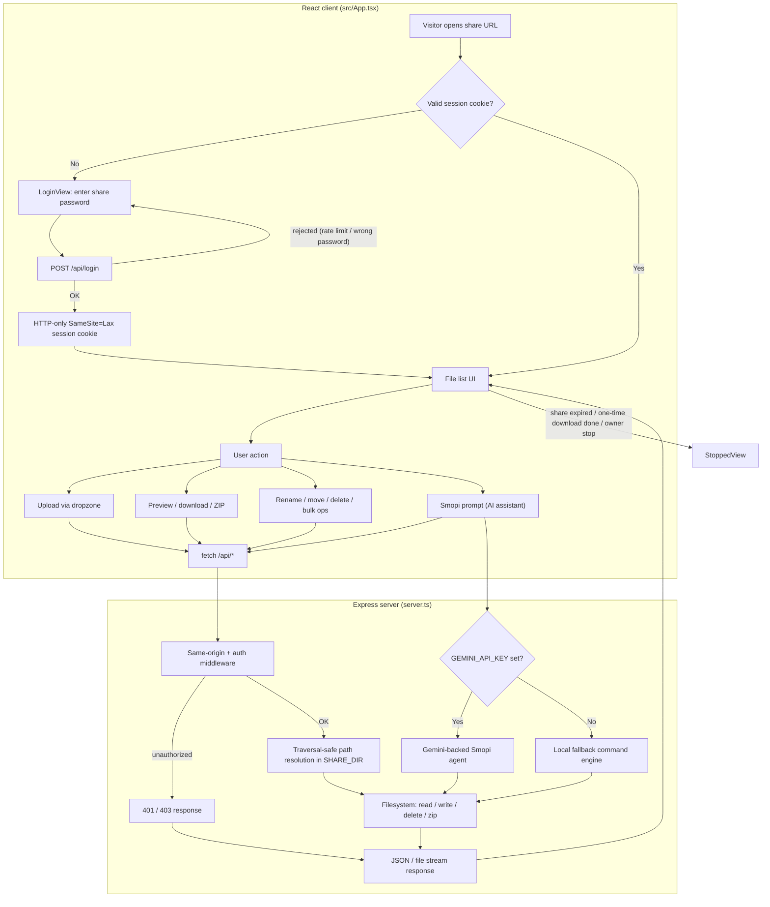

# File Share

A lightweight, password-protected, temporary file-sharing server with an AI
file-management assistant ("Smopi").

This repository contains two implementations:

| Directory | Stack | Status |
|---|---|---|
| **root (`server.ts`, `src/`)** | Node / Express 4 + React 19 + Vite 8 + Tailwind 4 | **Active product** — this is what `npm run dev` / `npm run build` / `npm start` runs |
| **`cloned/`** | Python 3 standard library (+ optional Cloudflare Quick Tunnel) | **Reference upstream** (v3.5.1), superseded by the Node app; not wired into the build |

> ⚠️ `cloned/` exists as the original implementation this project was ported from.
> Its `server.py` and `templates/` are read-only reference material and are not
> executed by any npm script.

## Flow

High-level request flow through the app, from first visit to a file operation:



## Install (one-liner)

The recommended way to run the share on a server. Installs Node.js 22+ if
needed, clones the repo, builds `dist/server.mjs`, and exposes the `fsd`
command (start/stop/status/env/update/uninstall).

```bash
# Linux / macOS
curl -fsSL https://raw.githubusercontent.com/JCVERSA/file/main/scripts/install.sh | sh

# Windows (PowerShell)
irm https://raw.githubusercontent.com/JCVERSA/file/main/scripts/install.ps1 | iex
```

Then configure a password and start:

```bash
fsd env set SHARE_PASSWORD my-secret
fsd start        # production server (background), default port 3000
fsd status       # share stats
```

See `fsd help` for the full command set, or `fsd uninstall` to remove.
The installer also accepts `--source-dir <checkout>` to install from local
code and `--branch <name>` to pick a branch.

## Quick start (developer)

Requires Node.js 22+ (the repo uses a Bun lockfile; npm also works).

```bash
npm install --legacy-peer-deps   # peer dep ranges in the scaffold are loose
SHARE_PASSWORD=my-secret npm run dev
```

Then open `http://localhost:3000` and enter `my-secret`.

Production build & run:

```bash
npm run build
SHARE_PASSWORD=my-secret npm start   # node dist/server.mjs
```

## Scripts

| Script | What it does |
|---|---|
| `npm run dev` | tsx dev server (Express + Vite middleware) |
| `npm run build` | Vite client build + esbuild ESM server bundle (`dist/server.mjs`) |
| `npm start` | Run the production server bundle |
| `npm run lint` | `tsc --noEmit` with `noUnusedLocals`/`noUnusedParameters` |
| `npm test` | End-to-end smoke suite (`node --test tests/`) |

## Configuration (environment)

| Variable | Purpose | Default |
|---|---|---|
| `SHARE_PASSWORD` / `PASSWORD` | Share unlock password | random 12-hex at boot (printed to logs) |
| `SHARE_EXPIRY` | Share lifetime in seconds | `1800` (30 min); `0` disables expiry |
| `SHARE_ONE_TIME` | `true` stops the whole share after the first completed download | `false` |
| `OWNER_SESSION_SECRET` | When set, owner-only actions (stop share, restart, password disclosure) require `POST /api/login-owner` with this secret | unset ⇒ single-admin mode |
| `SHARE_DIR` | Absolute path to the backing files directory | `./shared_files` |
| `PORT` | HTTP listen port | `3000` |
| `GEMINI_API_KEY` | Enables the Gemini-backed Smopi agent (otherwise a local fallback engine runs) | unset |

## Security model

- Single share password (timing-safe compare, 5-attempt/min/IP login limit).
- Sessions via HTTP-only `SameSite=Lax` cookie (plus bearer/query token for the
  embedded preview); session TTL is capped so it never outlives the share.
- **Owner/guest split (opt-in):** set `OWNER_SESSION_SECRET` to restrict
  stop/restart and password disclosure to `POST /api/login-owner`.
- Same-origin guard on mutating requests rejects cross-site posts (CSRF).
- Path traversal/symlink safe resolution, forced-download for active content
  (HTML/SVG/JS/…), SVG never rendered inline (stored-XSS defense).
- `X-Content-Type-Options: nosniff`, frame + referrer policies.

## Testing

`npm test` spins up an isolated instance (random port + temp `SHARE_DIR`) and
verifies: auth, upload/list/preview round-trip (incl. non-ASCII names),
safe download content types/disposition, SVG neutralization, ZIP generation,
bulk delete, owner gating, unauthenticated rejection, path traversal, and the
same-origin guard.

## Notes

- `AI Studio` injects `GEMINI_API_KEY` at runtime; when it is unset, Smopi runs
  a local (non-LLM) command engine.
